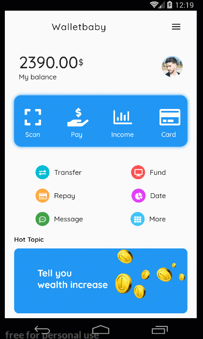
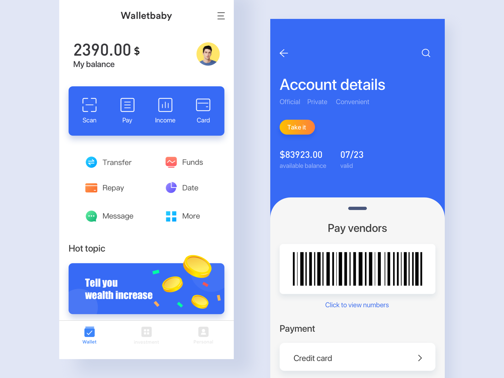
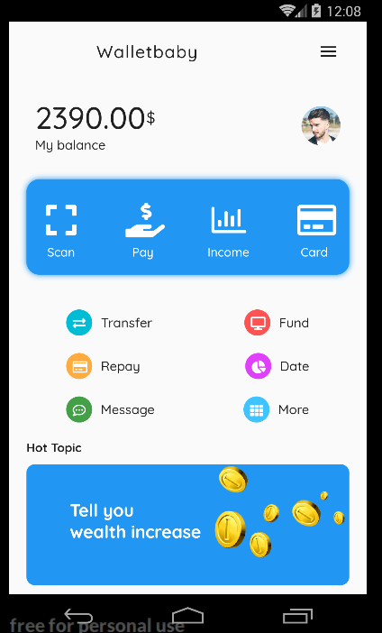
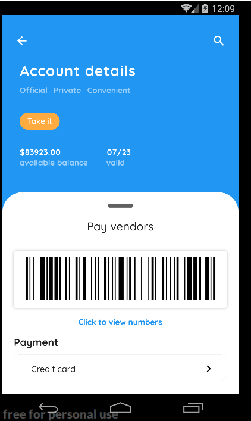

# cream_wallet_redesign

A new Flutter project.

- A redesign app from designer, big shout out to designer [Cream](https://dribbble.com/shots/6937002-This-is-a-wallet-payment-page-design) on dribbble
- original design can be found on [dribbble here](https://dribbble.com/shots/6937002-This-is-a-wallet-payment-page-design)

## Demo app

### Screenshots
- Original dribbble design image

#### my redesign
- the redesigned home page

- the redesigned account details page

## Acknowledgements
1. Dribbble designer [Dribbble CREAM designer](https://dribbble.com/shots/6937002-This-is-a-wallet-payment-page-design)
2. Pixabay image [Pixabay designer, FREE PHOTOTS](https://pixabay.com/photos/man-portrait-guy-person-male-1246508/)

## Getting Started

This project is a starting point for a Flutter application.

A few resources to get you started if this is your first Flutter project:

- [Lab: Write your first Flutter app](https://flutter.dev/docs/get-started/codelab)
- [Cookbook: Useful Flutter samples](https://flutter.dev/docs/cookbook)

For help getting started with Flutter, view our
[online documentation](https://flutter.dev/docs), which offers tutorials,
samples, guidance on mobile development, and a full API reference.
